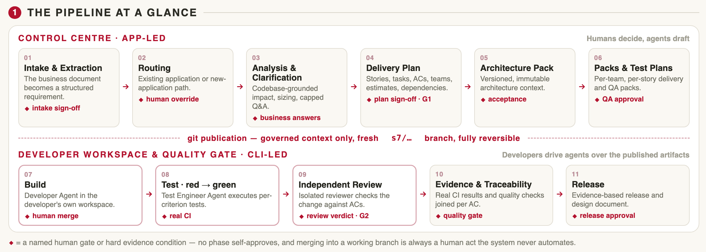
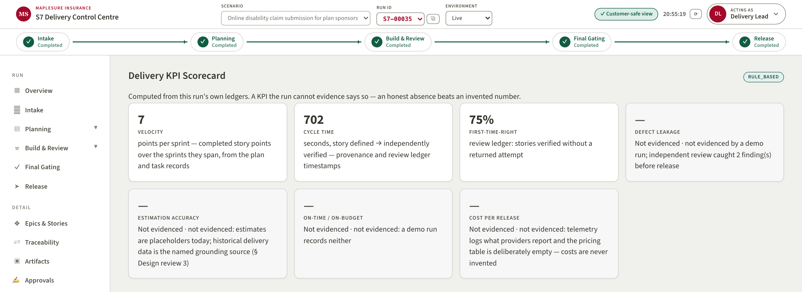

# Engineering Excellence Expo 2026

Two-page case study submission form

**Instructions**: Keep the completed entry to exactly two pages. Replace all prompts with final content, observe every word limit, use sanitised and approved information, and attach only assets available for internal publication.

## 1. Project snapshot (Complete all fields)

| | |
|---|---|
| **Project title** | Control Center — Governed AI-Assisted SDLC |
| **Team member names** | Alan Lands |
| **Unit/ISU** | BFSI Canada — Group 1.1 |

**Engineering theme (Select all that apply):**

- [x] GenAI
- [x] Automation
- [ ] Cloud
- [ ] Data engineering
- [ ] Platform engineering
- [ ] DevSecOps
- [ ] Performance engineering
- [ ] Accessibility
- [ ] Sustainability
- [ ] IoT
- [ ] High-performance systems
- [ ] Modernization
- [ ] Scalability

## 2. Executive summary

*Challenge, solution, business outcome, and engineering excellence | Maximum 150 words*

The delivery scope of a BFSI Canada pursuit asks for a business requirement carried end to end — intake, design, stories, build, test, production release — with AI assistance the business can trust. Generic AI tooling fails governance: fabricated output, no provenance, no human control points. The Control Center answers with a governed AI-assisted SDLC: LLM-driven intake analysis and planning grounded in the target repositories, human sign-off gates at every phase, and a downstream developer–tester–independent-reviewer lane. Every artifact carries visible provenance (live AI, rule-based, or simulated) and no phase self-approves. Outcome: a new business requirement went from intake to a released, running application in one autonomous overnight run — real repository, pull request, merge, and 98.5% test coverage. Engineering excellence shows in the honesty architecture: deterministic replay lets a fresh clone run fully offline, and the KPI scorecard reports only what run ledgers evidence.

## 3. Business challenges

*Problem statement/opportunity, constraints, and importance | Maximum 150 words*

The client's delivery scope requires business-driven, multi-sprint change delivered end to end — from business requirement through design, build, test and production release — using an AI-assisted SDLC, measured on delivery KPIs: velocity, cycle time, first-time-right, defect leakage. Three constraints shaped the build. The solution must survive a locked-down environment: no cloud-managed services, no vendor-native tooling, pinned dependencies. No client data may appear anywhere, so every scenario runs on a synthetic insurance domain (MapleSure). And AI claims must survive scrutiny — staged or rule-based output presented as live AI is the single failure that loses the room. The opportunity: most AI-SDLC demonstrations stop at code generation. Demonstrating governance — who approved what, on which evidence, with what provenance — is what converts an AI story into a delivery commitment a client can sign. An honest, articulated 70% AI coverage beats a claimed 100% that fails one question.

## 4. Solution (Engineering differentiators are mandatory)

*Architecture, decisions, tools, platforms, technologies, and differentiators | Maximum 250 words*

**Architecture.** A React + TypeScript control plane over a plain-Python engine. Every LLM call routes through one provider-agnostic module (five providers, OpenAI-compatible escape hatch) with live/record/replay modes. Stage outputs land at deterministic paths as an artifact plane with a provenance chain — each artifact names what produced it and which upstream artifact it derives from. A server-validated phase state machine rejects out-of-order actions.

**Key decisions.** The system is the governed control plane, not an IDE: humans own implementation in their own tools, while the platform generates governed context (versioned architecture packs, delivery packs, AC-derived test skeletons), publishes it to fresh git branches restricted to managed paths, collects CI evidence, and orchestrates review. Human gates are load-bearing: intake gate, plan sign-off, QA test-plan approval, dependency-gated developer workspaces with a governed override, release approval.

**Differentiators.**

1. **Provenance-first honesty** — every artifact is badged LIVE_AI, RULE_BASED or SIMULATED; simulated work is never counted as AI output.
2. **No phase self-approves** — an independent second model reviews generated work before a human ever sees it.
3. **Deterministic replay** — committed recordings mean a fresh clone with zero API keys runs the full pipeline offline; demo reliability by design.
4. **Cache-efficient prompting** — fixed prompt-prefix ordering plus cache read/write telemetry make cost per release measurable rather than asserted.
5. **Evidence-derived KPIs** — the scorecard computes velocity, cycle time and first-time-right from the run's own ledgers, and reports "not measurable" with the reason where it cannot.

## 5. Impact (Report percentage change; use N/A if not measurable)

| Impact area | % change |
|---|---|
| Business value | N/A — first delivery; client baseline not yet established |
| Productivity | N/A — no pre-AI baseline; one requirement taken to release in a single overnight autonomous run |
| Cycle time | −78% in governed evidence-sync turnaround (65s → 14s, measured) |
| Other metrics | 98.5% test coverage on the delivered application; 100% of artifacts carry provenance badges |

## 6. Key assets (Include whatever is available)

- [x] Diagrams
- [x] Dashboard
- [x] Accelerator
- [x] Images

**Key asset description | Maximum 100 words**

Working Control Center application — runs fully offline from a fresh clone with no API keys. Live end-to-end evidence pack: a real requirement taken to a released application with repository, pull request, merge and 98.5% coverage. Data-flow and entity-relationship diagrams generated from the run's own stories and repositories. Delivery KPI scorecard dashboard computed from run ledgers. Release/design document auto-rendered from run records as portable markdown and themed HTML. Architecture-pack and delivery-pack templates reusable as an accelerator for governed AI delivery on any engagement. Recorded demo walkthrough and presenter script available for internal publication.

**Asset/Image 1**

**Caption** (maximum 20 words): Governed delivery flow — intake, design, human gates, and the AI build–test–review lane over one artifact plane.

**Asset/Image 2**

**Caption** (maximum 20 words): Delivery KPI scorecard computed from run ledgers — unmeasurable KPIs reported with reasons, never invented.
