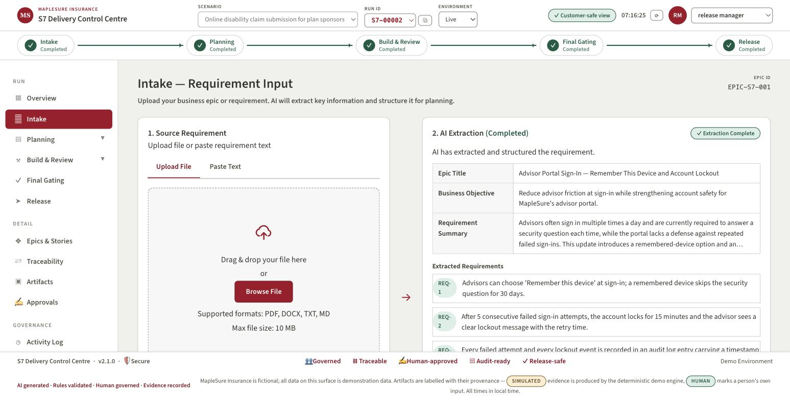
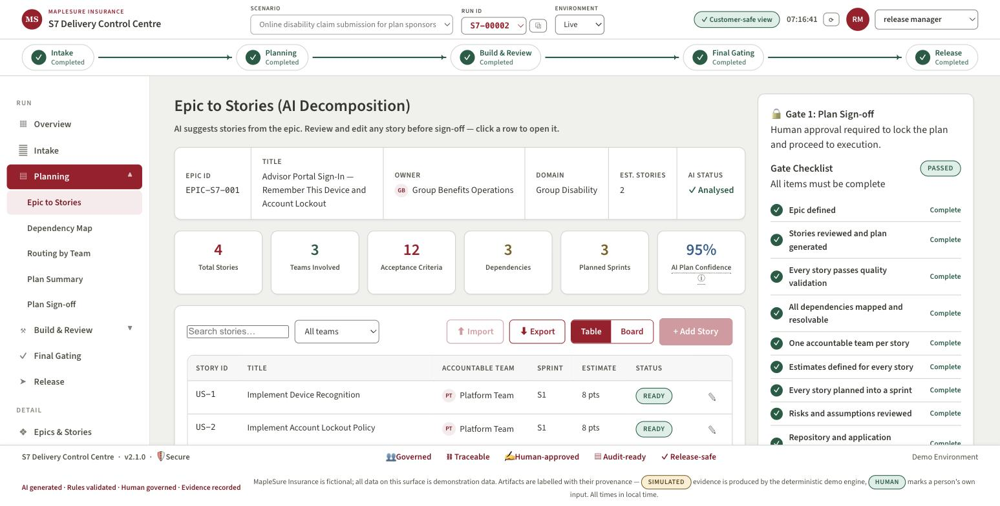
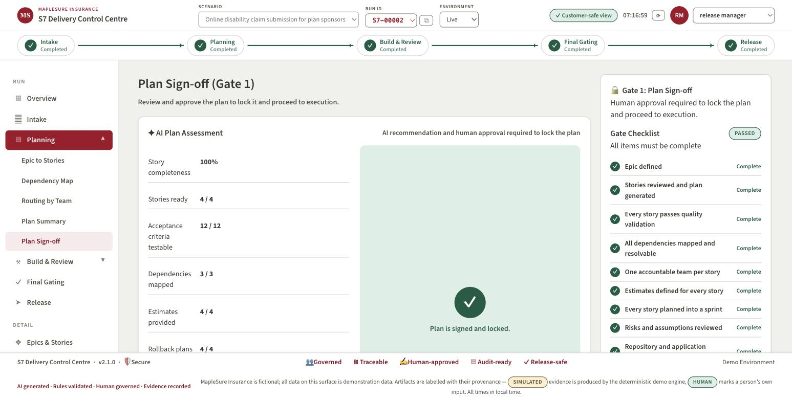
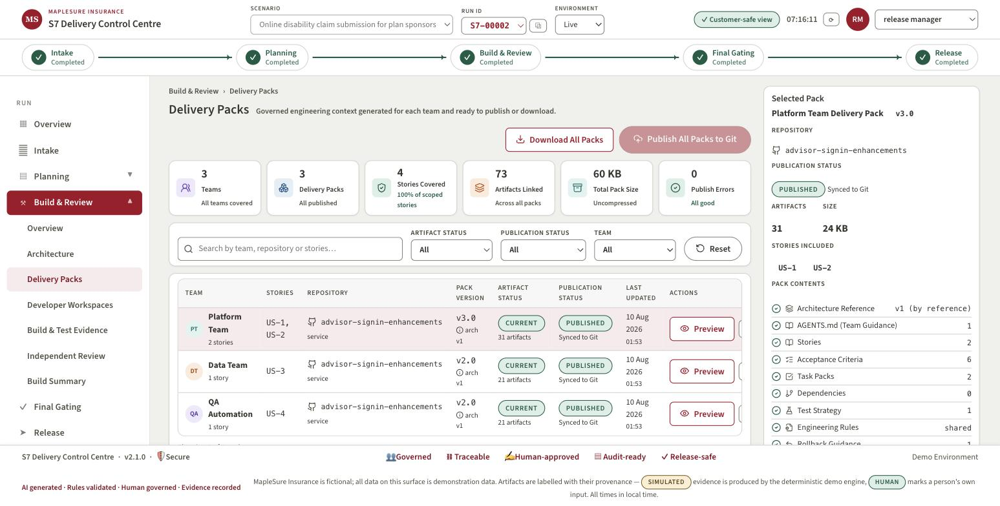
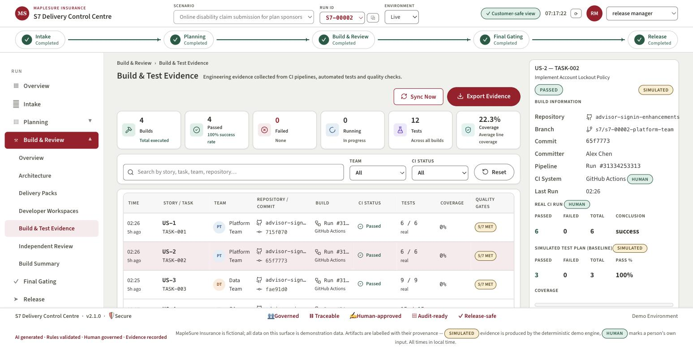
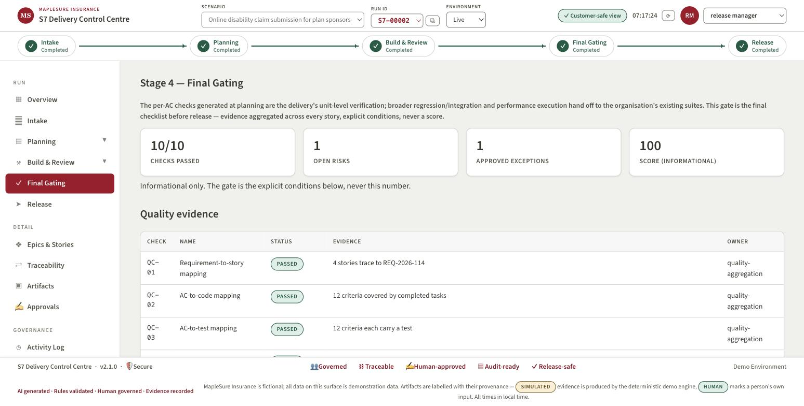
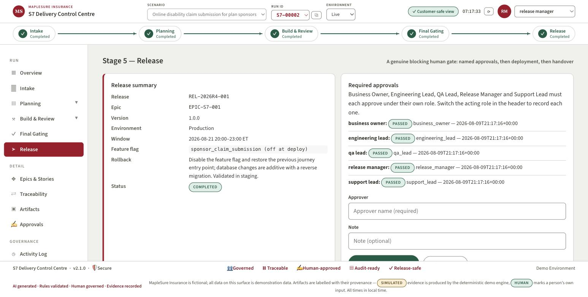

# S7 Control Centre — Live End-to-End Demo Guide

> **Superseded for presenting.** The canonical runbook is
> `docs/presenter-guides/main-demo-runbook.md`; this guide predates human
> business rules and the release document and stays as live-mode
> background reading.

**Audience:** the client (referred to only as "the client" — never by name).
**Insurer fiction:** MapleSure Insurance. **Length:** ~15 minutes.
**Story:** one small requirement travels the full lifecycle — intake, design,
human sign-off, real code, independent review, release — in a single app,
with a real GitHub repo and real CI in the loop.

---

## Pre-flight checklist (do this before the room fills up)

- [ ] **Start the server:** `demo/run_control.sh` (binds `127.0.0.1:8720`).
      If the venv isn't built yet: `python3 -m venv .venv && .venv/bin/pip
      install -r requirements.txt` first.
- [ ] **Kill any stale server on :8720** before starting — an old build
      silently serves a pre-change UI. `lsof -ti:8720 | xargs kill` if needed.
- [ ] **Set `LLM_MODE=replay`** in `.env` before starting the server. Every
      live call replays from the committed recordings in
      `s7_delivery/cache/llm/` — same words, zero API spend, zero network
      risk, zero chance of the model saying something unrehearsed.
- [ ] **`gh auth status`** confirms you're logged in — needed only if you
      intend to actually push (step 7) rather than narrate over a rehearsed
      run. `git status` should also be clean on the target repo's local
      clone.
- [ ] **Target repository:** the rehearsed run creates
      `advisor-signin-enhancements` through the app's own new-application
      flow — **delete it from GitHub before the demo** (`gh repo delete
      AlanLands/advisor-signin-enhancements`) if you want the create-repo
      beat live again, or keep it and use the one-click reconnect beat
      instead. Both were rehearsed on 2026-08-10.
- [ ] **Replay accuracy:** the LLM recordings match the EXACT texts in the
      copy-paste blocks below. In `LLM_MODE=replay`, paste them verbatim —
      a changed word is a changed prompt, and replay will refuse rather
      than improvise (that refusal is honest, but it's not the demo).
- [ ] **Browser:** open `http://127.0.0.1:8720` once before the room fills,
      confirm the page loads and a run exists in the Run ID picker.
- [ ] **Rehearse once, start to finish, the day before.** A beat that's
      adequate five times in five beats one that's impressive four times in
      five.

> **If something breaks:** switch the **Environment** selector in the header
> from *Live* to *Demo* (simulation). Simulation is the permanent fallback —
> deterministic, offline, and every artifact still carries an honest
> provenance badge (`SIMULATED`, `RULE_BASED`, `AI Generated`, etc.). Nothing
> in this app ever shows staged output unlabelled. Say that out loud if asked
> — it's a selling point, not an apology.

---

## The story in one breath

*S7 turns a business requirement into governed engineering context. AI
drafts; a named human approves every phase change. Developers write code
normally, in their own tools — S7 never touches their editor. Independent
review, not self-approval, gates release. Every artifact says, on its face,
whether it's AI-generated, rule-based, human-edited, or simulated.*

---

## The rehearsed run — what actually happened (run S7-00002)

This guide is not hypothetical. The full flow below was executed live, end
to end, the night before the demo — real model calls, a real GitHub
repository, real CI runs. Every number in this table is read from that
run's own committed artifacts, not estimated.

| Stage | What actually happened |
|---|---|
| **Intake** | The requirement in Step 2 was pasted and AI-extracted live — title, business objective, and 3 numbered requirements, badged **AI Extraction** |
| **Routing** | With zero repos connected the verdict short-circuited to **New application needed** with **no model call at all**; the conversational setup then named the app and **created the real GitHub repo** `advisor-signin-enhancements` (Java 21 / Spring Boot / Maven), CI workflow bootstrapped automatically |
| **Planning (G1)** | Live plan: **4 stories, 12 acceptance criteria** — US-1 *Device Recognition*, US-2 *Account Lockout Policy*, US-3 *Audit Logging*, US-4 *Automated Testing* — routed across Platform, Data and QA Automation teams; Business Owner signed and the plan locked |
| **Architecture** | Five-file pack generated **after** G1, never before, into immutable `architecture/v1/`; accepted by the Engineering Lead |
| **Test plans** | 12 rule-based failing tests, one per acceptance criterion (e.g. `test_given_an_advisor_signs_in_when_they_choose_rem…`); the **QA Lead approved all three team packs** — publish stayed hard-blocked (HTTP 409) until each approval landed |
| **Publication** | Three real branches — `s7/s7-00002-platform-team`, `…-data-team`, `…-qa-automation` — carrying only `AGENTS.md`, `.s7/**` and `src/test/java/s7/**`; GitHub Actions ran **red on each branch**, the honest baseline |
| **Developer loop** | **4 pull requests merged**: #1 US-1/US-2 device recognition + lockout, #2 US-3 audit logging, #3 US-4 automated tests, #4 US-4 JaCoCo coverage — 15 JUnit tests on `main`, every commit carrying its story id |
| **Evidence sync** | All **12 acceptance criteria flipped failed → passed**, each row linking to its real GitHub Actions run; line coverage **89.2%**, read from JaCoCo through CI — never self-reported |
| **Independent review** | 4 reviews executed by the isolated reviewer role (never the author) — all approved |
| **Final Gating** | **10 of 12 checks passed**; QC-08 *Operational readiness* and QC-12 *Performance test hand-off* honestly reported **not applicable** rather than silently green |
| **Release** | Five-role approval chain completed; deployment `DEP-001` recorded (pipeline reference badged *simulated* — there is no production MapleSure to deploy to); smoke tests 8/8; transition to maintenance accepted with runbook, knowledge-article update `KB-2026-0473` and a 7-day hypercare window |

One distinction to keep ready if asked: everything upstream — extraction,
planning, architecture, publication, code, CI, review — was genuinely live.
The deployment record itself is a governed simulation **and says so on its
face**. That labelling discipline is the product.

---

## Step 1 — Start a live run, connect the repository

**Do:** Header → **Environment** selector → switch **Demo** to **Live**. This
posts a new run and reloads. Go to **Intake**, expand **Advanced: Live
Analysis & Governance**, find **Connected Repositories**.

If `maplesure-sponsor-portal` shows under **Previously connected**, click the
**⤴ Connect** icon next to it — one click, no retyping the URL. (The **✕**
next to it is **Forget** — removes it from the reconnect list entirely; don't
click that one today.) Otherwise paste the URL and click **Connect
repository**.

**Say:**
- **"This is a genuinely live run** — it will call a real model and touch a
  real GitHub repository, not a script."
- **"Reconnect is one click.** Every repo we've ever connected is remembered
  — connect once, reconnect forever, forget it if you don't want it
  remembered."
- **"Nothing is grounded in nothing.** The run won't analyze a requirement
  until it knows which real codebase it's grounded against.

**Audience sees:** the repo appear under Connected Repositories with its
head commit and file count — a real shallow clone, not a mock.

---

## Step 2 — Intake: upload, extract, route, create the epic

**Do:** Intake page, card **1. Source Requirement** → **Paste Text** tab.
Paste the rehearsed requirement below **verbatim** (it matches the committed
replay recordings), then click **Extract with AI**.

```
Advisor Portal Sign-In — Remember This Device and Account Lockout

Business objective: reduce advisor friction at sign-in while strengthening account safety for MapleSure's advisor portal.

Summary: Advisors sign in several times a day and currently answer a security question on every attempt. At the same time, the portal has no defence against repeated failed sign-ins. This change adds a remembered-device option and an account lockout policy with auditable evidence.

Requirements:
1. Advisors can choose "Remember this device" at sign-in; a remembered device skips the security question for 30 days.
2. After 5 consecutive failed sign-in attempts, the account locks for 15 minutes and the advisor sees a clear lockout message with the retry time.
3. Every failed attempt and every lockout event is recorded in an audit log entry carrying a timestamp and the masked username.
```

**If you route with zero repos connected** (the rehearsed path), the verdict
short-circuits to **New application needed** with no AI call; **Start New
Application Setup** then asks for the stack — answer verbatim:

```
Java 21 with Spring Boot and Maven; JUnit 5 for tests. The application is the advisor-portal-sign-in service handling advisor authentication for the MapleSure advisor portal.
```

The AI names the app `advisor-signin-enhancements`, you review the scaffold
(README.md + architecture.md) and click **Create Repository** — a real GitHub
repo, created and connected, CI workflow bootstrapped as **maven** from your
stated stack.

Card **2. AI Extraction** fills in — title, business objective, summary,
numbered requirement bullets. Then open **Requirement Routing** → click
**Route Requirement**.

**Say:**
- **"Nothing here is canned.** The extraction reads the actual text you just
  pasted — title, objective, numbered requirements — and it's badged **AI
  Extraction**, not presented as more than it is."
- **"Before we spend a single AI call on analysis, the system asks a
  cheaper question first: does this fit an application we already know, or
  does it need a new one?** That's the routing verdict — and a human can
  always override it."
- **"With zero repos connected, this step short-circuits straight to
  'new application needed' — no model call at all. It's connected, so it
  routes to the real repo instead."**

**Audience sees:** the extraction card fill in live, then the **Requirement
Routing** card show **Verdict: Fits connected repos**, with reasoning text
and the candidate repository named. Then click **Create Epic & Pass Intake
Gate →** at the bottom of the Extraction card.



---

## Step 3 — Clarifications, then analysis grounded in the repo

**Do:** Back in **Advanced: Live Analysis & Governance**, click **Ask AI
Clarification**. Answer the 1–2 questions that appear (or leave one blank to
show a stated assumption). Submit. Then click **⟳ Regenerate Analysis** to
run the full AI Analysis.

**Say:**
- **"The clarification loop is capped — two rounds, no infinite back-and-
  forth. If you don't answer, the model states an assumption instead of
  stalling."**
- **"Every one of these calls is grounded in the same file: the target
  repo's own `architecture.md`** — components, data model, what's explicitly
  *not* part of the app. That's how a model without a fine-tune stays honest
  about a codebase it's never seen trained into it."
- **"The analysis checklist — business impact, stakeholders, dependencies,
  risks — is the AI's read of the requirement against that real repo, not a
  generic template."**

**Audience sees:** the clarification Q&A card appear and clear once
answered; the **AI Analysis (Completed)** checklist fill in with ticks,
counts, and an AI Confidence percentage.

---

## Step 4 — Planning: epic → stories, edit one, sign the plan (G1)

**Do:** Left nav → **Planning → Epic to Stories**. Click **✦ AI Suggest
Stories**. Click into one story row to open **Edit Story**, tweak the title
or an acceptance criterion, **Save Changes**. Then **Planning → Plan
Sign-off**. In the **Gate 1: Plan Sign-off** rail, fill **Approver name** and
**Approval Note**, click **🔒 Approve Plan & Lock**.

**Say:**
- **"AI drafts 2–3 stories with acceptance criteria, dependencies, estimates
  and a target repository — a human can edit any of it before sign-off, and
  every edit is tracked as AI Generated • Human Edited."**
- **"This is Gate 1 — a named human, a required note, a genuine e-signature
  render. It's not a checkbox; the plan is provably locked after this, and
  every downstream artifact traces back to this exact version."**
- **"Notice what G1 does NOT authorize: it approves the plan, not
  production code. Architecture generation is the next, separate step —
  the AI still hasn't written anything executable."**

**Audience sees:** the Gate 1 checklist ticks turn green as conditions are
met; after signing, **Plan Sign-off** shows Signed by / At / Version, and the
plan becomes read-only.





---

## Step 5 — Architecture pack: generated, versioned, human-accepted

**Do:** **Build & Review → Architecture**. Click **✦ Generate Architecture**.
Once it renders, click **Accept Architecture** (enter an approver name).

**Say:**
- **"Architecture only becomes available once the plan is locked — this is
  the 'through design' step the client asked for, made concrete: component
  map, repository layout, integration contracts."**
- **"It's versioned and immutable — `architecture/v1/`, never edited in
  place. If the plan changes later, a new version is generated and the old
  one stays exactly as it was signed off against."**
- **"Same rule as Gate 1: the service generates it, but a human — the
  Engineering Lead — accepts it. No phase in this app approves itself."**

**Audience sees:** the five-file architecture pack render (component map,
data model, integration contracts, deployment constraints…), a version badge
(`v1`), and — after acceptance — a green **Accepted by [name]** chip.

---

## Step 6 — Delivery packs, and the brand-new Test Plan gate

**Do:** **Build & Review → Delivery Packs**. Click **✦ Generate Delivery
Packs**. Open one team's pack. Scroll to **Test Plan — Acceptance Criteria**.
Try **Publish to Git** *before* approving — point at the disabled button and
the hint text. Then click **Approve Test Plan (QA Lead)**. Now **Publish to
Git** is enabled.

**Say:**
- **"This is new tonight. Every delivery pack now ships with a test plan:
  one failing test per acceptance criterion, generated by rule, not by a
  model** — badged accordingly, because a checklist derived from AC text
  isn't an AI claim."
- **"And it's a real gate, not a suggestion. Try to publish before QA
  signs off** — [click it] — **blocked.** The button's disabled client-side,
  but it's enforced server-side too: the API itself returns a 409 if you try
  to route around the UI."
- **"Once the QA Lead approves it, publish unlocks — same 'no phase
  self-approves' discipline as architecture."**

**Audience sees:** the AC → test table (one row per criterion, a generated
test name); the disabled **Publish to Git** button with tooltip *"Test plan
awaiting QA approval"*; then, after approval, the green **Approved by QA
Lead** line and the button going live.



---

## Step 7 — Publish to Git: the real red baseline

**Do:** Click **Publish to Git**. Confirm in the modal — note the **Managed
Paths: `AGENTS.md · .s7/**`** line (plus `tests/s7/**` for pytest-runnable
stacks). Confirm publish.

**Say:**
- **"This creates a real branch — `s7/<run-id>-<team>` — on the actual
  repository. It's verified in code to never be the default branch, so
  there's no way this accidentally lands on `main`."**
- **"It touches exactly three things: `AGENTS.md`, the `.s7/` context
  folder, and the generated test skeletons under `tests/s7/`. Nobody's
  source code is touched — that's enforced, not promised."**
- **"CI runs on that branch right now, on GitHub, for real. And it's
  supposed to fail — those are the acceptance-criteria tests, and nothing's
  implemented yet. That red run is the honest starting line, not a bug."**

**Audience sees:** the **Published Successfully** modal with repository,
branch, commit sha, and artifact count; if you have the GitHub Actions tab
open in a second window, the check run appears and goes red within seconds.

---

## Step 8 — The developer loop (Human Controlled · AI Assisted)

**Do:** **Build & Review → Developer Workspaces**. Point at the workspace
card's own label: **Human Controlled · AI Assisted**. If pre-rehearsed, switch
to a terminal/IDE window showing: `git clone`, opening `.s7/` and
`AGENTS.md`, implementing the change, `git commit -m "US-00X: ..."`,
`git push`, opening a PR on GitHub, merging it.

**Say:**
- **"This is the part S7 deliberately does not do. A human developer clones
  the branch we just published, reads `AGENTS.md` and `.s7/` in their own
  IDE — no plugin, no proprietary tooling, plain markdown and JSON — and
  writes the code themselves."**
- **"S7 is the governed control plane, not an IDE. It generates context and
  collects evidence; it never generates production code and never watches
  the developer work."**
- **"The only convention we ask for is the story id in the commit message —
  that's what lets S7 match real commits back to the story automatically."**

**What the developer actually receives** — this is the real branch S7
published in the rehearsed run, nothing added:

```
s7/s7-00002-platform-team            ← the branch S7 published
├── AGENTS.md                        ← start here: the story, the rules, the finish line
├── .s7/
│   ├── shared/
│   │   ├── architecture.md          ← the accepted v1 architecture pack
│   │   ├── engineering-rules.md
│   │   ├── git-workflow.md          ← governed branch/commit/PR conventions
│   │   └── assigned-stories.json
│   ├── stories/US-1/
│   │   ├── story.md                 ← the story exactly as signed off at G1
│   │   ├── acceptance-criteria.md
│   │   └── test-manifest.json       ← which test proves which criterion
│   └── tasks/TASK-001/
│       ├── task.md
│       └── test-plan.md             ← the QA-approved test plan
└── src/test/java/s7/
    ├── US1AcceptanceTest.java       ← red on purpose — the finish line, in code
    └── US2AcceptanceTest.java
```

Plain markdown and JSON — readable in any IDE, by any human, by any AI
assistant. No plugin, no proprietary format.

**And what they do with it** — the actual command sequence from the
rehearsed run (PR #1, merged the same evening):

```
$ git clone github.com/AlanLands/advisor-signin-enhancements && cd advisor-signin-enhancements
$ git switch s7/s7-00002-platform-team     # read the context S7 published
$ cat AGENTS.md .s7/stories/US-1/story.md  # own IDE, own AI assistant — S7 isn't watching

$ git switch -c feature/us-1-us-2-signin-security main
$ mvn test                                 # RED — the acceptance tests fail, as designed
      ...implement device recognition and lockout, normally...
$ mvn test                                 # GREEN — 15 tests pass
$ git commit -m "US-1 / US-2: device recognition and account lockout"
$ git push && gh pr create                 # PR #1 → review → merge to main
```

The story id at the front of the commit message is the whole integration
contract — it is how Sync from Git attributes that commit, that PR and
that CI run back to US-1 and US-2 without S7 ever touching the developer's
machine.

**Audience sees:** (live) a real commit landing on the branch, a PR opening,
CI re-running; (rehearsed) the same, narrated over a short recorded clip.

---

## Step 9 — Sync from Git: the strip turns real

**Do:** **Build & Review → Build & Test Evidence** (or **Developer
Workspaces**). Click **Sync Now** / **Sync from Git**.

**Say:**
- **"This pulls real commits, real PR status and real CI results back from
  GitHub — nothing here is simulated once you're in live mode."**
- **"Watch the AC → test table: it was all red a minute ago. Now it reflects
  the actual CI run on the actual branch."**
- **"This is the same button whether the news is good or bad — sync doesn't
  editorialize."**

**Audience sees:** commit hash, PR link, CI badge (Passed/Running/Failed)
populate; the AC-by-AC test table flips from initial-red to current-result,
sourced from the real pipeline. In the rehearsed run this sync brought back
**4 merged PRs, all 12 acceptance criteria failed → passed** (each row
linking to its actual GitHub Actions run) **and 89.2% line coverage** read
from JaCoCo.



---

## Step 10 — Independent Review

**Do:** **Build & Review → Independent Review**. Click **Execute Independent
Review** on the ready item.

**Say:**
- **"This reviewer is isolated — a separate role, and in live mode a
  separate model call, that never wrote the code it's reviewing."**
- **"There's no Approve/Reject button, deliberately — that verdict is the
  review itself, not a human rubber stamp on top of it. If it finds a major
  gap, the task goes back to the developer with the finding attached, and
  when it comes back, that's a brand-new review version — the blocked one is
  never overwritten, so the history stays honest."**
- **"This is the strongest governance idea in the whole app: no phase
  approves its own output."**

**Audience sees:** the review verdict (Approved / Rework Required), the
finding if any, and — if you've pre-staged a defect for drama — the return-
to-development path and a second, passing review version underneath the
first in Review History.

---

## Step 11 — Final Gating

**Do:** Left nav → **Final Gating**. Click **Run quality checks**, then walk
the evidence table.

**Say:**
- **"This is the last checklist before release — evidence aggregated across
  every story, explicit conditions, never a single score."**
- **"And here's the honest boundary: the per-acceptance-criterion checks we
  just watched run are this delivery's unit-level verification. Broader
  regression, integration and performance testing hand off to the client's
  own existing suites — we initiate that conversation, we don't pretend to
  replace it."**
- **"That's a deliberate choice, not a gap we're hiding: claiming coverage
  we don't have loses more trust than admitting the boundary."**

**Audience sees:** the Quality evidence table (Check / Name / Status /
Evidence / Owner), risks and approved exceptions panels, and the **Decide
final gate (QA Lead)** action. In the rehearsed run the gate passed **10 of
12 checks**, with QC-08 (operational readiness) and QC-12 (performance
hand-off) reported *not applicable* — worth pointing at, because a system
that will say "not applicable" out loud is a system whose "passed" means
something.



---

## Step 12 — Release: five-role approval chain, deploy, handover

**Do:** Left nav → **Release**. Switch the header **role picker** through
each of the five roles, entering an approver name for each: **Business
Owner, Engineering Lead, QA Lead, Release Manager, Support Lead**. Click
**Deploy to production (Release Manager)**, then **Complete transition to
maintenance**.

**Say:**
- **"Five named roles, five separate approvals — not one signature standing
  in for a team. Switch the role, sign, switch again — you can watch the
  approval matrix fill in one row at a time."**
- **"Deploy writes a change record: pipeline reference, strategy, smoke
  tests, post-deployment checks — the paperwork a real release needs."**
- **"And the run doesn't end at deploy. Transition to maintenance hands off
  a runbook, a knowledge article, monitoring alerts and an escalation path
  to support — the client asked for delivery through production release, and
  this is the 'through' part landing."**

**Audience sees:** the approval matrix filling in per role with names and
timestamps; the **Deployment** card (pipeline, strategy, artifacts, smoke
tests); the **Transition to maintenance** card (support team, runbook,
hypercare days) — a genuinely complete run, top to bottom.



---

## Closing line

*"Every artifact you saw tonight told you what it was — AI-generated,
rule-based, human-edited, or simulated — on its own face. That labelling
discipline is the actual product: not that AI writes the plan, but that you
can always tell which parts it wrote."*
